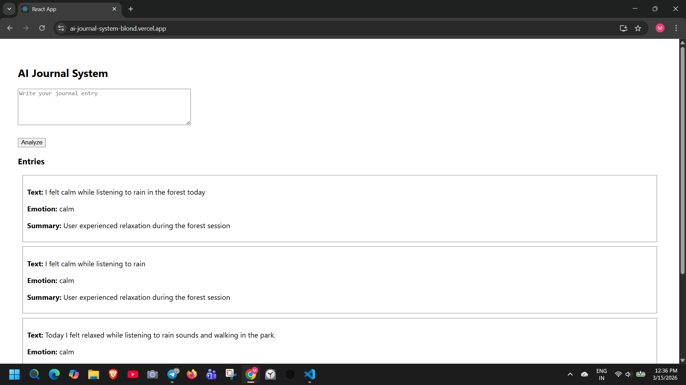
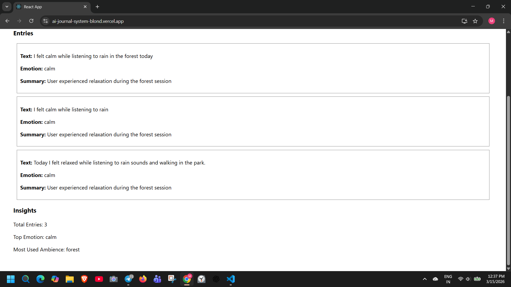

# AI Journal System

An AI-powered journaling application that analyzes user journal entries to detect emotions, generate summaries, and provide personal insights.

## Live Demo

Frontend: https://ai-journal-system-blond.vercel.app
Backend API: https://ai-journal-system-1-9adz.onrender.com

---

## Screenshots

### App Interface



### Insights Dashboard



---

## Features

* Write and store journal entries
* AI-powered emotion detection
* Automatic summary generation
* View past journal entries
* Insights dashboard with analytics

---

## Tech Stack

Frontend: React
Backend: Node.js + Express
Database: MongoDB Atlas
AI Model: Google Gemini API
Deployment: Vercel (Frontend) + Render (Backend)

---

## Architecture

React Frontend → Node.js API → MongoDB Atlas → Gemini AI

More details available in **ARCHITECTURE.md**

---

## Installation (Run Locally)

Clone the repository

```
git clone https://github.com/mohitraj0901/ai-journal-system.git
cd ai-journal-system
```

### Backend

```
cd backend
npm install
node server.js
```

### Frontend

```
cd frontend
npm install
npm start
```

---

## Future Improvements

* User authentication
* AI mood trends over time
* Better UI/UX design
* Real-time analytics dashboard

---

## Author

Mohit Raj
B.Tech CSE (AI & Data Science) – IIIT Ranchi
